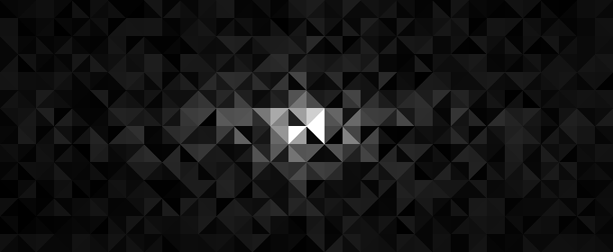

# Crystal Canvas
this turtle-based tiny project aims to have fun with turtle grapich library while producing an artistical-stylish library which can be used by people, i hope. the simplest use of the crystal canvas would be as followed. by default, it randomizes a shade for each shard and renders triangular noise with the size of 600x240.

<table>
    <tr>
        <th width="45%">implementation</th>
        <th width="55%">rendered result</th>
    </tr>
    <tr>
        <td colspan="2"></td>
    </tr>
    <tr>
        <td><pre>
#import the class
from crstcanvas import CrystalCanvas</pre>
            <pre>
#render it
CrystalCanvas().draw()</pre></td>
        <td>
            
        </td>
    </tr>
</table>
 

### Advanced Usage

> optionally, the `constructor` of CrystalCanvas() provides flexibility to control output quality and resolution.

|name       |default         |info                              |
|-----------|----------------|------------------                |
|res        |(600,240)       |render resolution                 |
|grid_res_y |3               |shards' resolution                |
|margin     |50              |htmler knows it                   |
|kernel     |lambda a,b,t: t |kernel function (explained below) |

 

> moreover, in order to form a pattern on a canvas, a `kernel` function can be implemented to do so in a manner.
> it accepts some parameters related to each draw of a shard with the following details and return a density value of a color.

|name    |info                                                             |
|--------|-----------------------------------------------------------------|
|x       |relative position on x-axis within range `[-1.0, 1.0]`           |
|y       |relative position on y-axis within range `[-1.0, 1.0]`           |
|tone    |value within range `[0.0, 1.0]` randomed initially for each shard|

 

### Inspirational Kernel
<table>
    <tr>
        <th width="45%">kernel</th>
        <th width="55%">rendered result</th>
    </tr>
    <tr>
        <td colspan="2"> </td>
    </tr>
    <tr>
        <td><pre>
#diamond gredient
def kernel(x,y, tone):
    divisor = (abs(x) + abs(y))*8
    return tone/divisor</pre>
CrystalCanvas(kernel=kernel).draw()
</td>
        <td></td>
    </tr>
    <tr>
        <td colspan="2"></td>
    </tr>
    <tr>
        <td><pre>
#sine wave
def kernel(x,y, tone):
    yt = 0.6*sin(2*x*3.14)
    diff = 1 - abs(yt-y)/0.4
    impact = diff-0.4
    return tone + impact</pre>
CrystalCanvas(kernel=kernel).draw()
</td>
        <td>
            
        </td>
    </tr>
    <tr>
        <td colspan="2"> </td>
    </tr>
    <tr>
        <td><pre>
#mellow horizontal gredient
def kernel(x,y, tone):
    addition = sqrt(abs(x))
    tone += addition
    return 1-tone</pre>
CrystalCanvas(kernel=kernel).draw()
</td>
        <td>
            
        </td>
    </tr>
    <tr>
        <td colspan="2"></td>
    </tr>
    <tr>
        <td>
<pre>
#tilted gredient
def kernel(x,y, tone):
    yt = 3*x
    diff = 1 - abs(yt-y)/1.4
    impact = diff - 0.6
    return tone + impact</pre>
CrystalCanvas(kernel=kernel).draw()
</td>
        <td>
            
        </td>
    </tr>
        <tr>
        <td colspan="2"></td>
    </tr>
    <tr>
        <td>
<pre>
#reversed tilted gredient
def kernel(x,y, tone):
    yt = 3*x
    diff = 1 - abs(yt-y)/1.4
    impact = diff - 0.6
    return 1 - (tone + impact)</pre>
CrystalCanvas(kernel=kernel).draw()
</td>
        <td>
            
        </td>
    </tr>
</table>

###### latest README.MD update : 1 April 2018 0:26am
